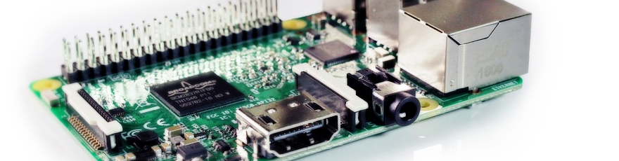

# Install Raspbian on Raspberry Pi for Windows users

[Original document from Open Devices
GmbH](https://github.com/opendevices/iot.apps/blob/master/doc/od-iot-raspbian-rpi-zero-windows.md)

Authors:

[Djalal Harouni](https://github.com/tixxdz)

[Nazim Djafar](https://github.com/nwd0)


Install for:



Or


---

This guide will show you step by step, how to install a Raspbian OS on a 

**Raspberry Pi 3 or Zero with WiFi**, enable **ssh** service and configure **WiFi** connection
without using a keyboard, screen and mouse .

For this installation we need some equipment and software.
  - MicroSD card.
  - MicroSD card reader , if your computer don’t have a MicroSD card slot.
  - Power supply with micro USB cable.

Software:
  - Rasbpian image .
  - Etcher Software .

  The process is very simple, download a Raspbian image and Etcher software,
  use Etcher to write the Raspbian image into the MicroSD card , configure WiFi connection
  enable SSH service and boot.


## 1. Download Raspbian.

  - Download the Rasbpian image, you can find the latest version here  [Raspbian image](https://www.raspberrypi.org/downloads/raspbian/).
  - All Raspbian versions are supported, however we recommend the Lite version to reduce resource and memory usage.

 


## 2. Copy Raspbian to the MicroSD card

 The simplest and easiest way to copy the Raspbian OS to your MicroSD card is, Etcher software.It's work well on Windows.

 - Download a Windows version of  Etcher software, from  [Etcher](https://etcher.io/)

 

 - Unzip it.
 - Install Etcher on your Windows system.

 

 - Insert the MicroSD card into the card reader.

 

  - Execute Etcher.
  - Once Etcher open, browse and select the Raspbian image.

  

  - Select the MicroSD card that you which to install Raspbian on.
  - Click on the flash button.

  

Once it's finished  Etcher **unmount** automatically the MicroSD card.

## 3. Configure Wifi

 To configure WiFi connection on Rapsberry Pi Zero W do

  - Remove the MicroSD card from the SD card reader.
  - Reinsert the Micro SD card into computer SD card reader.
  - Observe that a *boot* partition will mount automatically. On Linux there will be two partitions, however on windows
  only the *boot* partition will be displayed.

  

  - Open an empty **notepad** document and copy/paste the following lines
  - Use WiFi of your Android phone when starting this way you can easily get the Raspberry Pi IP address.


```
country=AU
ctrl_interface=DIR=/var/run/wpa_supplicant GROUP=netdev
update_config=1
network={
	ssid="SSID"
	psk="PASSWORD"
	key_mgmt=WPA-PSK
}
```

  - Replace **ssid** with your Wifi Network Name and **psk** with your WiFi password.
  - Save the file with the **wpa_supplicant.conf** under the **boot** partition.
  - **Make sure to save the file as wpa_supplicant.conf and not as wpa_supplicant.conf.txt as windows may add .txt
  extension automatically. Maybe save the file like this: "wpa_supplicant.conf" this way it won't be added. Otherwise
  your WiFi setup will fail, yes thank you Windows for wasting users time...**


  - Only for Linux: if you are working from Linux, save file under **rootfs** partition in **/etc/wpa_supplicant/**


## 4. Enable ssh

 To enable ssh remote login, just create an empty **ssh** file in boot partition.
 
 - Launch Notepad
 - Click on **File** and then **Save As..**, a dialog box is displayed.
 - Type an opening quotation mark, ssh and then closing quotation mark. Like this:  **"ssh"**


 - Click on the SD card **boot** partition to save file on it.
 - Click the **Save** button.


## 5. First boot

- Eject the Micro SD card properly to not damage it.
- Insert the Micro SD into Raspberry Pi,
- Power with Micro USB cable attached to electricity energy source, it is better.


- To access to your Raspberry Pi , via your Windows computer you need a ssh client
  like putty [putty](https://www.chiark.greenend.org.uk/~sgtatham/putty/latest.html)

- Setup putty
  * Host name : **raspberrypi.local**
  * Port: **22**
  * Default User Name: **pi**
  * Default Password: **raspberry**


- Complete ssh command to connect:

```bash
$ ssh pi@raspberrypi.local
```

