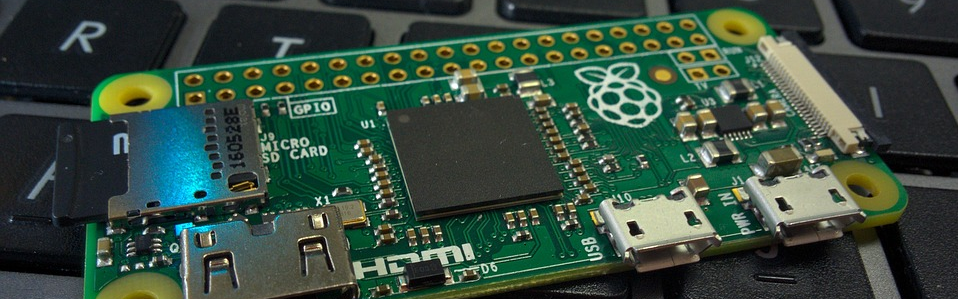
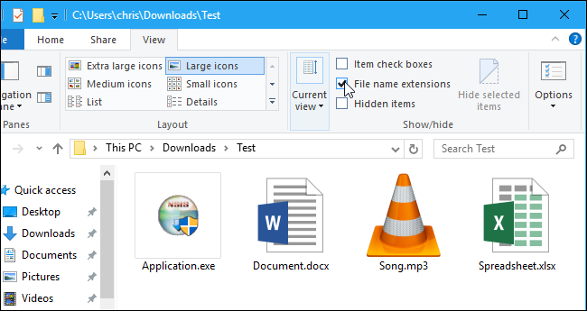
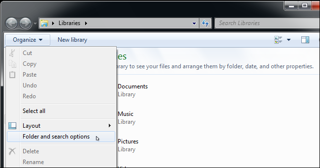

# Install Raspbian on Raspberry Pi for Windows users

[Original document from Open Devices
GmbH](https://github.com/ionoid-io-projects/workshop/blob/master/doc/od-iot-raspbian-rpi-zero-windows.md)

Authors:

[Belakhder Abdeldjalil](https://github.com/zendyani)

[Djalal Harouni](https://github.com/tixxdz)

[Nazim Djafar](https://github.com/nwd0)


Install for:

Raspberry Pi 3


Or

Raspberry Pi Zero W (with WiFi)


---

This guide will show you step by step, how to install a Raspbian OS on a 

**Raspberry Pi 3 or Zero with WiFi**, enable **ssh** service and configure **WiFi** connection
without using a keyboard, screen and mouse .

For this installation we need some equipment and software.
  - MicroSD card.
  - MicroSD card reader , if your computer don’t have a MicroSD card slot.
  - Power supply with micro USB cable.

Software:
  - Rasbpian image .
  - Etcher Software .

  The process is very simple, download a Raspbian image and Etcher software,
  use Etcher to write the Raspbian image into the MicroSD card , configure WiFi connection
  enable SSH service and boot.


## 1. Download Raspbian.

  - Download the Rasbpian image, you can find the latest version here  [Raspbian image](https://www.raspberrypi.org/downloads/raspbian/).
  - All Raspbian versions are supported, however we recommend the Lite version to reduce resource and memory usage.

 


## 2. Copy Raspbian to the MicroSD card

 The simplest and easiest way to copy the Raspbian OS to your MicroSD card is, Etcher software.It's work well on Windows.

 - Download a Windows version of  Etcher software, from  [Etcher](https://etcher.io/)

 

 - Unzip it.
 - Install Etcher on your Windows system.

 

 - Insert the MicroSD card into the card reader.

 

  - Execute Etcher.
  - Once Etcher open, browse and select the Raspbian image.

  

  - Select the MicroSD card that you which to install Raspbian on.
  - Click on the flash button.

  

Once it's finished  Etcher **unmount** automatically the MicroSD card.

## 3. Configure Wifi

To prevent futur probleme we'll activate file extension display on windows by following 
this instructions:

### On windows 8 and 10

- After opening a file browser click the “View” tab on the ribbon. 
- Activate the “File name extensions” box in the Show/hide section to toggle file extensions on or off. 

File Explorer will remember this setting until you disable it in the future.



### For windows 7

- After opening a file browser Click the “Organize” button on Windows Explorer’s toolbar and select “Folder and search options” to open it.
- Click the “View” tab at the top of the Folder Options window. Disable the “Hide extensions for known file types” checkbox under Advanced settings.
- Click “OK” to change your settings.




### Configure WiFi on Micro SDCard

 To configure WiFi connection

  - Remove the MicroSD card from the SD card reader.
  - Reinsert the Micro SD card into computer SD card reader.
  - Observe that a *boot* partition will mount automatically. On Linux there will be two partitions, however on windows
  only the *boot* partition will be displayed.

  

  - Open an empty **notepad** document and copy/paste the following lines
  - Use WiFi of your Android phone when starting this way you can easily get the Raspberry Pi IP address.


```
country=AU
ctrl_interface=DIR=/var/run/wpa_supplicant GROUP=netdev
update_config=1
network={
	ssid="SSID"
	psk="PASSWORD"
	key_mgmt=WPA-PSK
}
```

  - Replace **SSID** with your Wifi Network Name and **PASSWORD** with your WiFi password.
  - Save the file with the **wpa_supplicant.conf** under the **boot** partition.
  - **Make sure to save the file as wpa_supplicant.conf and not as wpa_supplicant.conf.txt as windows may add .txt
  extension automatically. Maybe save the file like this: "wpa_supplicant.conf" this way it won't be added. Otherwise
  your WiFi setup will fail, yes thank you Windows for wasting users time...**


  - Only for Linux: if you are working from Linux, save file under **rootfs** partition in **/etc/wpa_supplicant/**


## 4. Enable ssh

 To enable ssh remote login, just create an empty **ssh** file in boot partition.
 
 - Launch Notepad
 - Click on **File** and then **Save As..**, a dialog box is displayed.
 - Type an opening quotation mark, ssh and then closing quotation mark. Like this:  **"ssh"**


 - Click on the SD card **boot** partition to save file on it.
 - Click the **Save** button.


## 5. First boot

- Eject the Micro SD card properly to not damage it.
- Insert the Micro SD into Raspberry Pi,
- Power with Micro USB cable attached to electricity energy source, it is better.

- To access to your Raspberry Pi , via your Windows computer you need a ssh client
  like putty [putty](https://www.chiark.greenend.org.uk/~sgtatham/putty/latest.html)


To connect to your Raspberry device you must first get device ip, you may find it in your phone Hotspot or router,
otherwise there are other ways how to get it, the easiest one is to install mobile app **Fing**, The Fing app is a free network scanner for smartphones.


**Your phone and your Raspberry Pi have to be on the same network.**

So connect your phone to the correct wireless network (same ssid you used in wpa_supplicant)
- Start the app on your phone
- click on refresh button
- all connected ip will be displayed
- search for the one with raspberry pi icon

Congratulation you have your ip

To explore more way please visit [get ip address of raspberry pi](https://www.raspberrypi.org/documentation/remote-access/ip-address.md)

**Important: if you have multiple Raspberry Pis on the same network, the hostname will clash, as they are all by default
named 'raspberry', when you login on the Raspberry Pi, make sure to change the hostname in /etc/hostname file to avoid
such problems.**


### Using putty

Suppose your raspberry pi ip is **192.168.1.9** the result on putty will be as follow

**pi** are the default user for rasbian 


After clicking on **Open** and you'll see a new windows asking you to trust the host you're going to connect to

Just click yes (we trust our Raspberry pi)


a new terminal window will open ask you the password which is **raspberry**

Dont worry if you dont see it when you type it, just type it and click Enter on your keyboard


Congratulation if you see the next terminal window, you're connected to your device


### Using ssh

This is only for Linux

```bash
$ ssh pi@raspberrypi.local
```


### Security change user pi password

After having a terminal on your Raspberry Pi, make sure to change the **pi** password for security with the **passwd**
command.

Inside your Raspberry Pi device terminal tape the following:

```bash
passwd
```

**Note your new password**.
